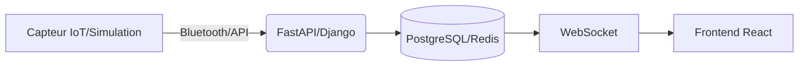

Voici une version **simplifiée et modernisée** du README pour votre nouveau projet **Digital Twin Sportif**, en conservant la même structure que l'ancien projet Weather-City mais avec le nouveau thème :

---

# **🏃 Athlete Performance Digital Twin**  
*Surveillance temps réel des données biométriques d'un athlète*

[](https://github.com/yourusername/athlete-digital-twin/actions)
[](LICENSE)

## **📖 Aperçu du Projet**  
Ce dashboard affiche en temps réel les performances d'un athlète (rythme cardiaque, vitesse, distance) via des capteurs IoT ou des données simulées.  
**Technologies clés** :  
- **Backend** : FastAPI/Django  
- **Frontend** : React + Chart.js/Plotly  
- **Temps réel** : WebSocket (Socket.io ou Django Channels)  
- **Base de données** : PostgreSQL/InfluxDB  

---

## **🚀 Démarrage Rapide**  
### Prérequis  
- Python 3.10+  
- Docker (optionnel)  
- Capteur IoT (ex: Polar H10) *ou données simulées*  

### Installation  
```bash
git clone https://github.com/yourusername/athlete-digital-twin.git
cd athlete-digital-twin
pip install -r requirements.txt
```

### Configuration (.env)  
```dotenv
API_KEY=<clé_capteur_ou_simulation>
REDIS_URL=redis://localhost:6379
```

### Lancer  
```bash
python app.py  # Backend
npm start     # Frontend (dans /frontend)
```
➡️ Ouvrir `http://localhost:3000`

---

## **📐 Architecture**  


1. **Collecte** : Données depuis un capteur ou génération aléatoire.  
2. **Stockage** : Sauvegarde dans une base de données temps réel.  
3. **Visualisation** : Dashboard interactif avec graphiques.  

---

## **🛠️ Fonctionnalités**  
✅ **Données temps réel** : Rythme cardiaque, vitesse, GPS  
✅ **Alertes** : Seuils personnalisés (ex: fréquence cardiaque trop élevée)  
✅ **Historique** : Comparaison avec les sessions passées  
✅ **Multi-sport** : Course, cyclisme, natation  

---

## **🚢 Déploiement**  
### Avec Docker  
```bash
docker-compose up --build
```
*Inclut : Backend, Frontend, Redis*

### Kubernetes  
Exemple :  
```yaml
kubectl apply -f k8s/deployment.yaml
```

---

## **📈 Améliorations Futures**  
- Intégration **Apple Watch/Garmin**  
- **Recommandations** d'entraînement (IA)  
- **Reconnaissance gestuelle** via caméra  

---

## **🤝 Contribuer**  
1. Forkez le projet  
2. Créez une branche (`feature/nouvelle-fonctionnalité`)  
3. Ouvrez une **Pull Request**  

---

## **📜 Licence**  
MIT © VotreNom  

---

### **📌 Notes**  
- Pour utiliser un **capteur réel**, configurez le fichier `sensors/config.py`.  
- Un script de simulation est inclus (`/simulator`).  

---

Cette version :  
- **Conserve la structure** de l'ancien projet  
- **Simplifie les étapes techniques**  
- **Met l'accent sur le sport** au lieu de la météo  

Besoin d'ajuster des détails ? 😊
